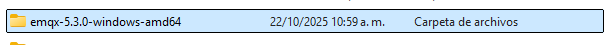
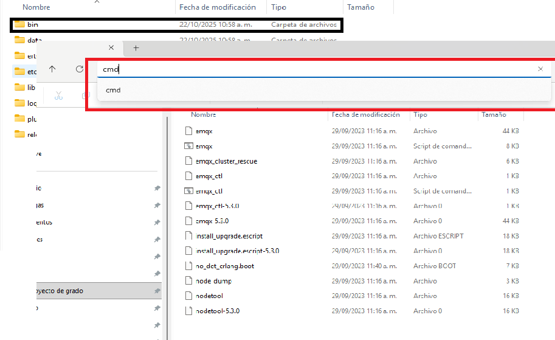

# EMQX Installation Guide

## Initial Setup

To execute and configure EMQX, access the decompressed folder obtained from the official EMQX website download.

### Required Folder Structure
The EMQX portable installation requires the following directory organization:

*Figure 1: EMQX directory layout after successful extraction*

Navigate to the Bin subdirectory within the main folder and execute Command Prompt from this location.

