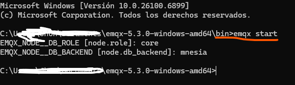
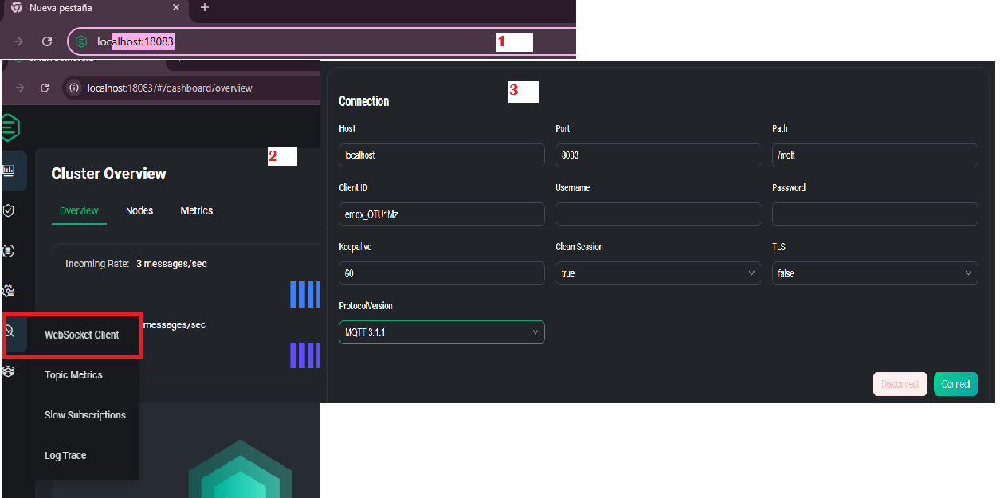
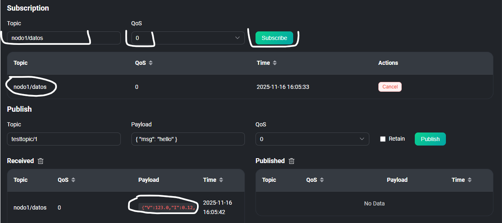

# EMQX Installation and Configuration Guide

## Initial Setup

To execute and configure EMQX, access the decompressed folder obtained from the official EMQX website download.

### Required Folder Structure
The EMQX portable installation requires the following directory organization:

*Figure 1: EMQX directory layout after successful extraction*

### Service Initialization
Navigate to the Bin subdirectory within the main folder and execute Command Prompt from this location.

*Figure 2: Accessing the Bin directory for service management*

A Command Prompt window will open. Enter the command `emqx start` to initialize the EMQX broker service.

*Figure 3: Initializing EMQX service via command line*

## WebSocket Client Configuration

### Dashboard Access and Connection Setup
After executing the start command in CMD, open your preferred web browser and navigate to `localhost:18083`. Log in using the configured credentials and click on the "WebSocket Client" option located in the left-hand menu.

In the Connection window that appears, configure the following parameters:
- **Host**: `localhost`
- **Port**: `8083` 
- **Path**: `/mqtt`
- **Client ID**: Leave as default
- **Keep Alive**: `60`
- **Clean Session**: `true`
- **TLS**: `false`
- **Protocol Version**: `MQTT 3.1.1`

*Figure 4: WebSocket client configuration in EMQX dashboard*

### Topic Subscription
Accept the connection and in the subscription panel, enter the topic name that publishes the JSON data. For our specific case, use `nodo1/datos`. Leave the Quality of Service (QoS) at level 0 and click Subscribe. With this configuration, the broker begins its operation.

*Figure 5: Configuring topic subscription in EMQX WebSocket client*

## Verification and Operation

Once all configurations are complete, the EMQX broker is fully operational and ready to handle MQTT communications between your IoT devices and the monitoring dashboard. The system will now process JSON data packets published to the `nodo1/datos` topic and distribute them to subscribed clients.
