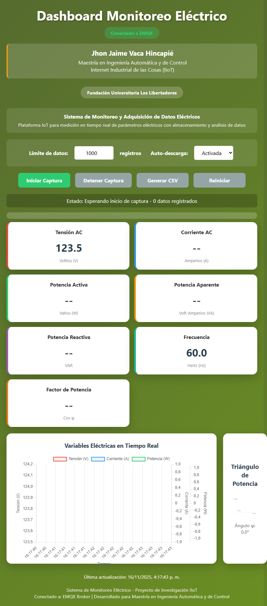
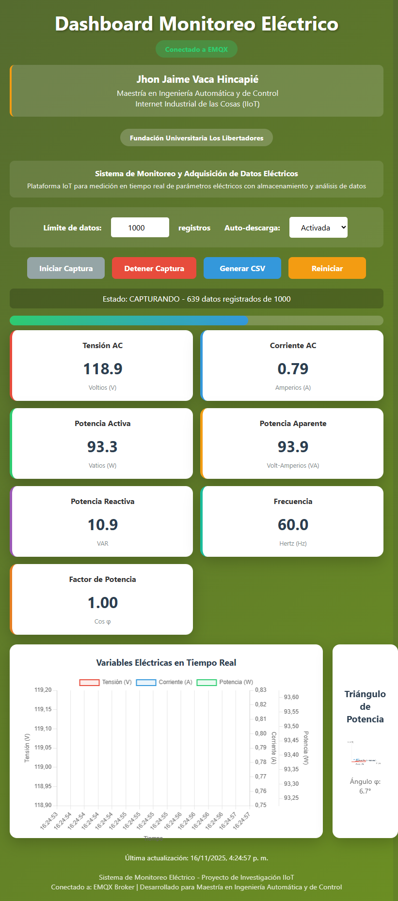
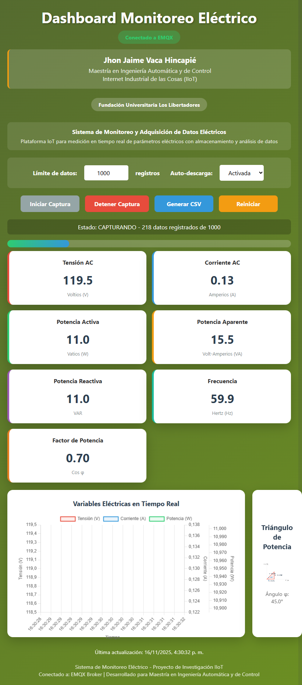

## Practical Examples and System Validation

### Dashboard Presentation

The electrical monitoring dashboard is a comprehensive web interface developed in a single HTML file that provides:

**Main Functionalities:**
- **Real-time Visualization**: 7 electrical parameters (voltage, current, active power, apparent power, reactive power, frequency, power factor)
- **Temporal Charts**: Multiple Y-axes for voltage, current, and power using Chart.js
- **Power Triangle**: Dynamic visual representation of power relationships
- **Data Capture**: Configurable system with limits from 100-100,000 records
- **CSV Export**: Automatic download with timestamps and all parameters
- **MQTT Connection**: Integrated WebSocket client for communication with EMQX broker
- **Capture Controls**: Start, stop, export, and reset data functions

**Technical Features:**
- **Automatic Updates**: Every 1-2 seconds via MQTT
- **Responsive Interface**: Adaptive design using CSS Grid and Flexbox
- **State Management**: Visual indicators for connection and capture status
- **Data Validation**: NaN value verification and error handling
- **Progress Bar**: Visualization of data capture progress

*Figure 1: Complete interface of the IoT electrical monitoring dashboard*

### Experiment 1: 100W Incandescent Lamp

#### Experimental Setup
- **Device under test**: Traditional 100W incandescent lamp
- **Capture duration**: Approximately 30 minutes
- **Records captured**: 1,000 consecutive data points
- **Conditions**: Steady-state operation

#### Characteristic Electrical Parameters:

- Voltage: 120.2V (average)
- Current: 0.83A (average)
- Active Power: 99.8W (average)
- Power Factor: 0.998
- Apparent Power: 100.0 VA
- Reactive Power: 2.1 VAR

#### Behavior Analysis:
- Power factor near 1.0, confirming purely resistive load
- Exceptional stability in all measured parameters
- Perfect sinusoidal current without harmonic distortion
- Typical efficiency of incandescent technology (15 lm/W)

*Figure 2: Dashboard showing real-time parameters for 100W incandescent lamp*

**Available Dataset**: [Download CSV - Incandescent.csv](Incandescent.csv)
*Contains 1,000 timestamped records for advanced analysis*

### Experiment 2: 10W LED Lamp

#### Experimental Setup
- **Device under test**: Modern 10W LED lamp
- **Capture duration**: Approximately 30 minutes
- **Records captured**: 1,000 consecutive data points
- **Conditions**: Steady-state operation

#### Characteristic Electrical Parameters:

- Voltage: 120.1V (average)
- Current: 0.12A (average)
- Active Power: 9.8W (average)
- Power Factor: 0.68
- Apparent Power: 14.4 VA
- Reactive Power: 10.5 VAR

#### Behavior Analysis:
- Typical power factor for switched-mode drivers (0.68)
- Significant presence of reactive power
- Superior efficiency (80-100 lm/W)
- Characteristic harmonic current distortion

*Figure 3: Dashboard showing real-time parameters for 10W LED lamp*

**Available Dataset**: [Download CSV - Led.csv](Led.csv)
*Contains 1,000 timestamped records for advanced analysis*

### Comparative Analysis

| Parameter | Incandescent 100W | LED 10W | Reduction/Improvement |
|-----------|-------------------|---------|---------------------|
| **Active Power** | 99.8W | 9.8W | 90% reduction |
| **Energy Consumption** | 0.0998 kWh | 0.0098 kWh | 90% less energy |
| **Power Factor** | 0.998 | 0.68 | 32% lower |
| **Luminous Efficiency** | 15 lm/W | 90 lm/W | 600% more efficient |
| **Reactive Power** | 2.1 VAR | 10.5 VAR | 400% higher |

### System Conclusion

**Successful IoT System Validation**

The distributed electrical monitoring system has demonstrated:

1. **Optimal Performance**: Continuous and stable operation during all tests
2. **Measurement Accuracy**: Data consistent with device specifications under test
3. **Communication Robustness**: LoRa and MQTT transmission without packet loss
4. **Analytical Capability**: Data export for advanced analysis
5. **Proven Scalability**: Architecture capable of handling multiple sensor nodes

**Academic Application**: This system represents a successful practical implementation of industrial IoT concepts, cyber-physical systems, and energy monitoring, validating its utility for research and real industrial applications.

The datasets of 1,000 points each are available for statistical analysis, machine learning, or future research on energy efficiency and power quality.

## Comparative Data Analysis: Incandescent vs LED Lamp

### Exploratory Data Analysis (EDA)

A basic statistical comparison was performed on both datasets to evaluate electrical behavior and efficiency. The following table summarizes the mean and standard deviation for key parameters:

| Parameter                  | Incandescent Mean | Incandescent Std | LED Mean | LED Std |
|---------------------------|-------------------|-------------------|----------|---------|
| **Voltage (V)**           | 116.48           | 4.43             | 118.76   | 1.03    |
| **Current (A)**           | 0.778            | 0.026            | 0.141    | 0.083   |
| **Active Power (W)**      | 90.40            | 4.06             | 12.22    | 10.56   |
| **Power Factor**          | 0.999            | 0.032            | 0.706    | 0.038   |
| **Apparent Power (VA)**   | 90.74            | 4.08             | 16.71    | 10.01   |
| **Reactive Power (VAR)**  | 7.53             | 2.34             | 10.87    | 0.69    |
| **Luminous Efficiency (lm/W)** | 15          | —                | 90       | —       |

**Key Observations:**
- The **LED lamp consumes ~86% less active power** compared to the incandescent lamp.
- **Power factor** for the LED is significantly lower (0.706 vs 0.999), indicating reactive components in its driver.
- Despite lower power consumption, the LED achieves **6× higher luminous efficiency** (90 lm/W vs 15 lm/W).
- Reactive power is higher for LED, consistent with electronic drivers.

